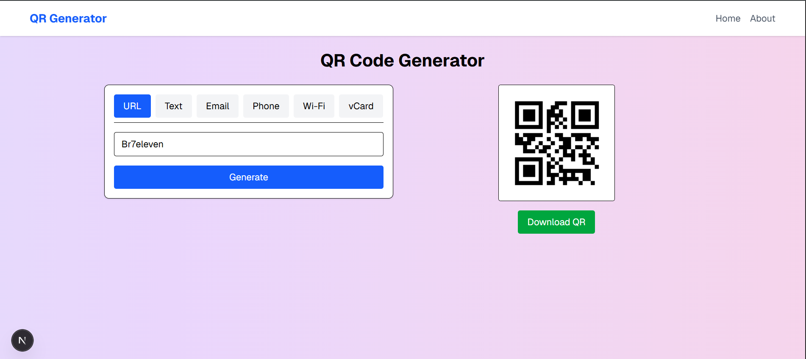

# QR Code Generator

A free and SEO-friendly QR code generator built with **Next.js** and **Tailwind CSS**.  
Supports multiple QR code types like URL, text, email, phone, Wi-Fi, and more.

## Features
- Server-side rendering for SEO optimization  
- Responsive design with Tailwind CSS  
- Multiple QR code formats (URL, Text, Email, Phone, Wi-Fi, vCard)  
- Downloadable QR codes as PNG  
- Clean layout with header, footer, and gradient background  

## Installation
```bash
git clone https://github.com/USERNAME/REPO_NAME.git
cd REPO_NAME
npm install
npm run dev
-----
````
## Project ScreenShot

## Project Structure
src/
  app/
    page.js
    layout.js
    globals.css
  components/
    Header.js
    Footer.js
    TabForm.js
    QRDisplay.js

## License

MIT License

### Follow For More Awesome Tech to Discover 
## Br7eleven
